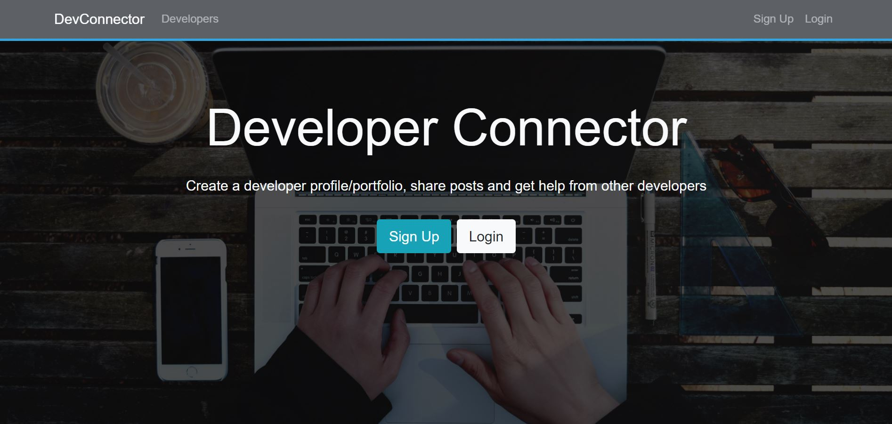
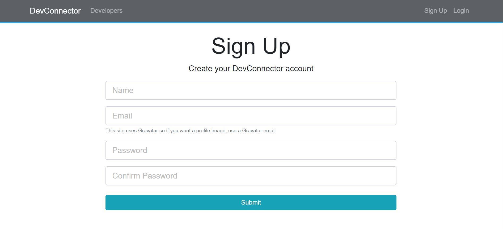
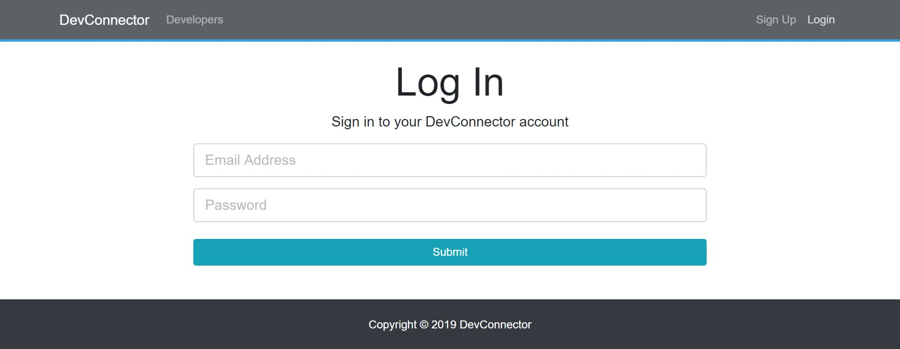
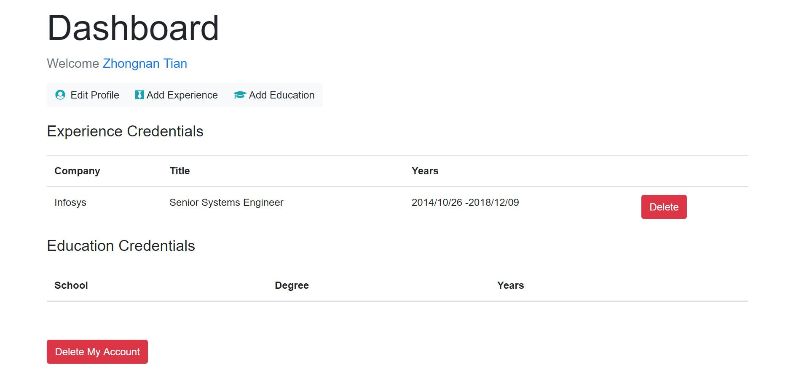
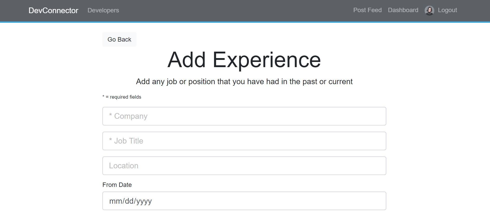
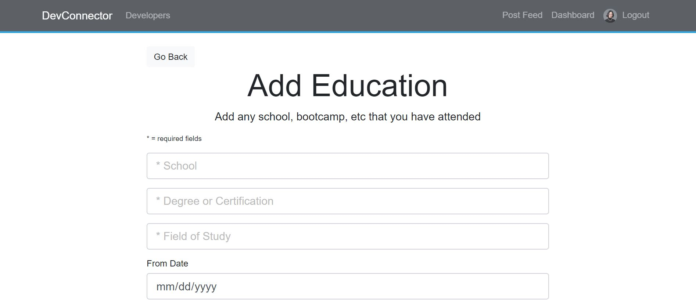
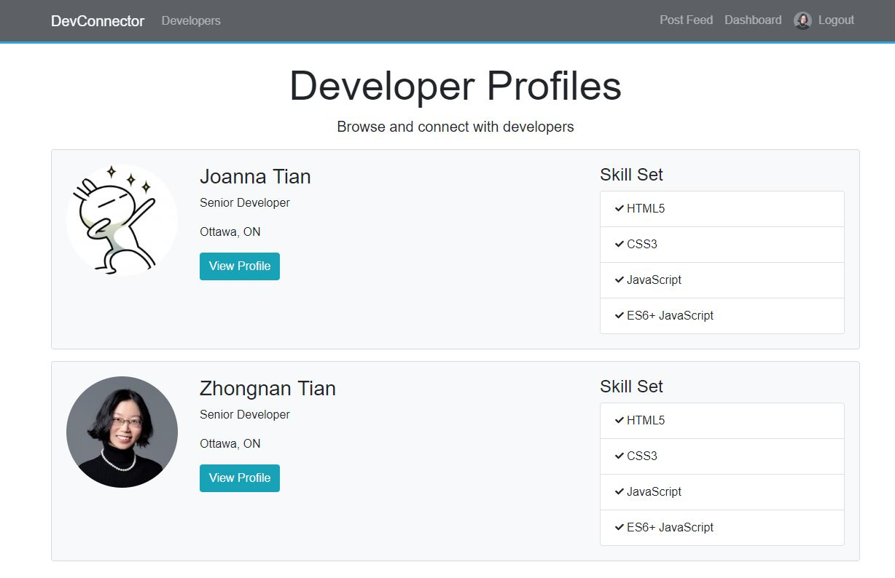
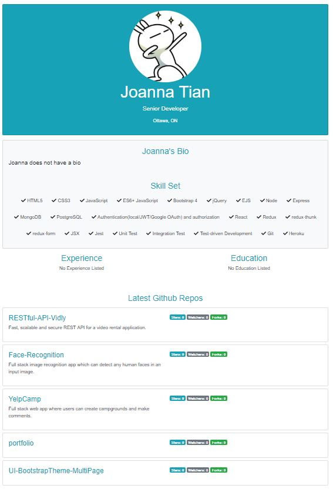
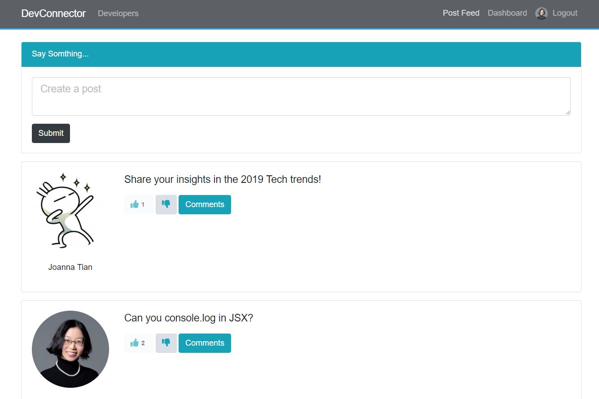
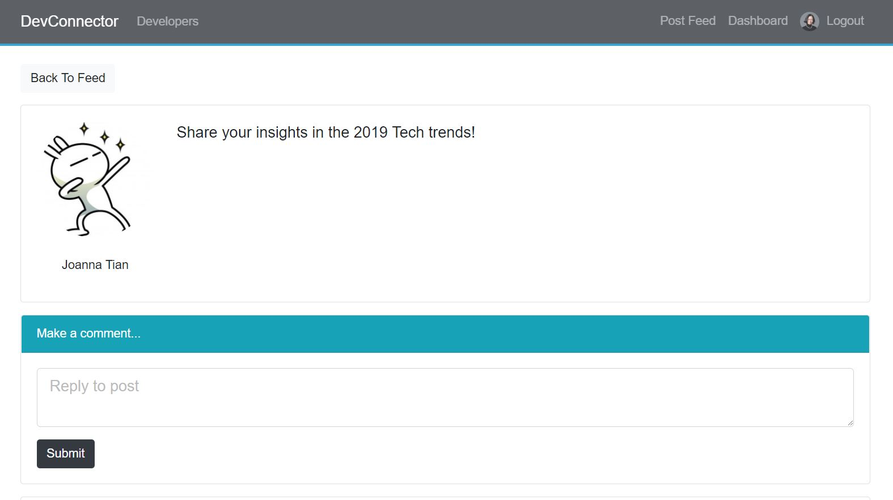

# MERN-Stack-DevConnector
Full stack social network app with authentication, dashboard, profiles, posts and comments. [View online](https://developers-connector.herokuapp.com/)

## Tech Used
Bootstrap 4, ES6 JavaScript, React, Redux, Node.js, Express, MongoDB, JWT, Git, Heroku

## Features
-	Extensive backend API with routes protected with JWT authentication 
-	Implement React and connect with the backend
-	Use Redux for app state management
-	Data validation  
-	Handle errors

## Screenshots
Homepage: 

Sign Up: 

Login: 

Dashboard: 

Add Experience: 

Add Education: 

Browse All Registered Users’ Profiles:

Create/Browse/Like/Unlike Posts:

Comment on Post:

## RESTful API Resources
/api/users

/api/profile

/api/posts

Note: resources have relations. For example: profile has user, post has user. 

## RESTful API Routes
1. 
GET /api/users/test

POST /api/users/login    (token will be sent in response)

POST /api/users/register  

GET /api/users/current  (protected route)

2.
GET /api/profile/test

GET /api/profile/   (protected route)

GET /api/profile/handle/:handle

GET /api/profile/user/:user_id

GET /api/profile/all

POST /api/profile/  (protected route)

POST /api/profile/experience  (protected route)

POST /api/profile/education  (protected route)

DELETE /api/profile/experience/:exp_id  (protected route)

DELETE /api/profile/education/:edu_id  (protected route)

DELETE /api/profile  (protected route)

3. 
GET /api/posts/test

GET /api/posts

GET /api/posts/:id

POST /api/posts  (protected route)

DELETE /api/posts/:id   (protected route)

POST /api/posts/like/:id   (protected route)

POST /api/posts/unlike/:id  (protected route)

POST /api/posts/comment/:id  (protected route)

DELETE /api/posts/comment/:id/:comment_id   (protected route)
 
